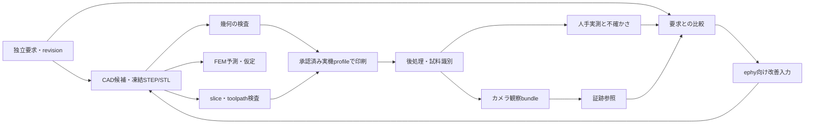

# Full Automate Robotics 実装ロードマップ

調査日：2026-10-08．本書は実装計画であり，無人製造設備の完成報告ではありません．最初の到達点は，共通モジュールラックの嵌合クーポンについて **CAD設計 → 幾何・製造指令の検査 → 人が監督する印刷 → 人手実測 → ephy向け改善入力 → 次の設計** を一往復させることです．ロボットによる取り外し・搬送・触覚検査は，この往復を再現できてから追加します．期限や進捗率ではなく，成果物と受入条件で段階を進めます．

## 1．確認した既存実装

`ephy-physical-ci` の調査基点は [commit 3cfb09f](https://github.com/kirimine170/ephy-physical-ci/tree/3cfb09f1f8abce96d54a7b1f6647ec58823ba738)，`ephy-cam` は [commit 11e81ef](https://github.com/kirimine170/ephy-cam/tree/11e81efae9049e3c4c0d40a4eb3b8cc926d92c60)です．以下はREADMEだけでなく，対象のsourceと契約文書を照合した状態です．

| 既存の成果物 | 実装済みの能力 | 今回の計画で補うもの |
| --- | --- | --- |
| [Mechanical CLI](../tools/mechanical-ci/README.md) の `validate` / `check-path` | mm・座標frame・入力hashを確認し，凍結単一solid STEPの指定平行移動を離散姿勢で検査 | 一般的な回転・6自由度の連続経路保証，製品の保持力 |
| [Tool screen](../tools/mechanical-ci/docs/tool-screen-v1.md) | 公称平底円筒工具の指定直進軸方向sweepを，一つの凍結STEP障害物へ照合 | 柄を含む任意工具，横移動・回転，実工具アクセス，除去力 |
| [Support screen](../tools/mechanical-ci/docs/support-roi-v1.md) と `slice` / `analyze-gcode` | 固定版ローカルPrusaSlicer，入力snapshotのhash結合，対応する直線押出指令の抽出，support/interface経路とAABB proxyの照合 | 実プリンタprofileの承認，造形品質，ヘッド全体の衝突，サポート除去 |
| [Measured length inspection v1](../tools/mechanical-ci/docs/length-inspection-v1.md) | 一試料・一寸法の人手JSONを独立した要求revisionへ照合し，明示した不確かさ方針で `pass/fail/indeterminate` を返す | 測定器接続，多寸法集約，画像による寸法生成，製品全体の合否 |
| [ephy-cam offline capture](https://github.com/kirimine170/ephy-cam/blob/11e81efae9049e3c4c0d40a4eb3b8cc926d92c60/docs/inspection-capture-v1.md) | 独立sessionと既存captureのsnapshotをhashで結合し，read-only再生と `evidence_refs` を生成 | 校正評価，寸法・不確かさの算出，Physical CI台帳・Karteへの接続 |
| [Mechanical experiments](../experiments/mechanical-ci/README.md) | 合成STEPの限定探索，線形FEM，保存slice証跡等の個別再現実験 | 統合pipelineと現物検証 |
| [XIAO holders](../hardware/xiao-first-fit-v0.1/README.md) | オリジナルの無通電fit確認用ホルダー・共通フット・トレーとデジタル検証 | 汎用ラックの寸法契約，現物fit・荷重・熱・通電確認 |

`inspect-length` は人手の測定記録を `evidence_class=measurement` と扱えますが，software自身は測定していないため `physical_validation=not_performed` と `printer_ready=false` を維持します．exit 0でも `fail`，`indeterminate`，入力不足による `not_run` があり，結果JSONを読む必要があります．

ephy-camのbundleは常に `metrology_eligible=false`，`physical_validation=not_performed`，`adopted=false` です．試料の同一性は `operator_assertion` であり，画像hashは現物の同一性を証明しません．校正の申告だけでは計測へ昇格しません．再生はJPEG decodeを行わず，旧XIAO referenceの時刻はJPEG受信後のhost保存時刻で，露光時刻は不明です．

既存の広い境界文書には連続衝突が未実装とありますが，`screen-tool` の限定した円筒軸方向sweepは実装済みです．一般的な連続6自由度検査とは分けます．本書は既存CLIのschemaや状態flagを変更しません．

## 2．共通1U/2U風モジュールラックを最初の対象にする

提案する対象は，交換式moduleを共通frameへ載せるラックです．カメラ，MCU，計測器，照明，電源の各adapterを同じ取付契約へ接続します．カメラ専用の棚をrack全体の基準にしません．最初は無通電のframe・rail・adapter couponだけでfitを確かめます．

`U_pitch_mm` を高さの共通増分とし，1U moduleは一段，2U moduleは連続する二段を占有する構成を提案します．数値，幅，奥行き，穴列，荷重は物理入力を得てから独立要求として凍結します．これは内部のmodular interface案で，19-inch rack等への規格適合・互換性をまだ主張しません．

| 共通interfaceで固定するもの | 初期に検査するもの |
| --- | --- |
| rack座標原点，基準面，挿入方向，`U_pitch_mm`，幅・奥行きenvelope | adapterの位置再現性，1U/2Uの占有と隣接moduleとの干渉 |
| rail/穴/ねじ/着座面の寸法とrevision，公差，組立方法 | rail幅，穴位置，着座深さの実測，実ねじ・工具の到達性 |
| moduleの質量・重心・支持位置，ケーブルの抜差し空間 | たわみ，保持，転倒，ケーブル引張の試験条件 |
| ケーブル経路，交換手順，放熱・照明・視野のenvelope | 実コネクタと照明の干渉，通電前の熱・電気条件 |
| 製造・検査のdatumと試料ID表示位置 | CAD→print→fixture→camera座標変換と試料の取り違え防止 |

既存XIAOの36 mm共通フットはadapter候補です．ラックの新しいrail規格や保持力の根拠には転用しません．フットの実測と，adapterの着座・脱落・熱条件を別に検証します．最初のCAD成果物は共通interfaceのcoupon，1U carrier，2U carrierの順とし，小さいcouponで公差を決めてからframe全体を印刷します．

カメラadapterは実際のboard・camera module・lens・ケーブルの型番とrevisionを確認して設計します．[Seeedのofficial guide](https://wiki.seeedstudio.com/xiao_esp32s3_getting_started/)はOV2640から後続OV3660への変更とOV5640互換を説明しています．同じXIAO名やsoftware例の互換性から機械的な外形・lens位置・ケーブル条件の一致を推定しません．flexの曲げ半径や許容力はmanufacturer資料または現物試験を得てから決めます．

### 設計意図を先に確定し，編集可能なtemplateへ渡す

最初の生成経路は，発話・指示位置から確認済みintent specificationを作り，検査済みparametric templateへparameterを渡す構成を提案します．modelなしのform入力も同じspecificationへ接続できます．自由な自然言語から任意CAD codeを作る方式は後段の比較候補です．形状の類似，constraint solverの成功，実際の機能達成を別々に評価します．

specificationには実board/model/revision，単位，座標frame，PCB envelope，接触可能面・禁止領域，USB plugの挿抜sweep，button・cable・antennaの空間，締結，moduleの挿入・交換，工具到達，製法・公差を持たせます．各値をofficial資料・現物測定・ユーザー確認・仮定へ出典分けし，hard constraint，選好，未確定を区別します．外形固定・内側拡張・壁厚固定のような矛盾は確認へ戻し，寸法を捏造しません．[XIAO familyのofficial資料](https://wiki.seeedstudio.com/SeeedStudio_XIAO_Series_Introduction/)の共通外形だけからUSB位置・高さ・拡張boardの互換を推定せず，最初は実在する一型番のcarrierから始めます．

発話と画像の指示位置は意図の候補を探す証跡です．時刻，画像領域，CAD revision，候補featureを結合し，「広げる」が穴径・壁間隔・部品間隔のどれかを確認します．映像だけから寸法，材質，荷重，組立意図を確定しません．遮蔽，camera移動，反射，似た部品，時刻ずれは拒否・確認へ戻る例として扱います．継続映像から自動変更する機能は初期milestoneに含めません．

`rack.slot[2].insertion_axis`，`carrier.board_support_plane`，`board.usb_axis`のようなsemantic IDを提案します．`Face7/Edge12`だけを保存せず，生成履歴と幾何条件へ結びます．parameter変更後は再解決し，候補ゼロ・複数，法線・位置・履歴の不一致を停止条件にします．最寄り面へ黙って置換しません．[CadQuery selectors](https://github.com/CadQuery/cadquery/blob/master/doc/selectors.rst)は選択条件を記述する入口ですが，意味IDの自動保証ではありません．[FreeCADのtopological naming資料](https://github.com/FreeCAD/FreeCAD-documentation/blob/main/wiki/Topological_naming_problem.md)も，改良後なお残る制約を説明しています．

[CadQuery assembly](https://cadquery.readthedocs.io/en/latest/assy.html#object-locations)は不足拘束・多解の場合に初期配置が解へ影響すると説明します．rack基準を明示固定し，回転を制限する軸・キーを定義したうえで，期待姿勢，mate残差，干渉を別に検査します．[SolveSpace library](https://solvespace.com/library.pl)の自由度・失敗拘束と[APIの結果分類](https://github.com/solvespace/solvespace/blob/master/include/slvs.h)は診断候補ですが，GPL条件とbindingを確認してから採用します．不足拘束，矛盾，非収束を分け，成功させるためにconstraintを自動削除しません．修復は回数・時間・変更範囲を限定します．

| M1で追加する受入観点 | 最小の確認 |
| --- | --- |
| intent | 矛盾・未入力・sideの取り違えを拒否し，保護parameterを確認済み値に保つ |
| geometry/function | solid数・体積・validity・envelope・壁・干渉に加え，実型番plugの寸法model，挿入・取り外し，工具・buttonの必要空間を別要求へ照合 |
| editing | slot数，壁厚，clearance，USB位置，filletの有無を宣言済み範囲で変更し，意味IDを再解決して意図した関係を維持 |
| solver | 期待自由度と失敗理由を記録．解が出ても向き・mate・非干渉を独立確認 |
| physical fitの要求 | M3/M4で実board/cableの着座・取り外し・保持・変形を確認する手順を定義し，M1では現物未検証gateとして残す．snapや温度条件は別の材料・工程試験 |

編集可能性は，宣言したparameter編集で必要な関係が保たれることとして検証します．任意の±20%変更に耐えることを一律条件にしません．単一BRep featureやSTEP/STLだけでは意味を持つfeature treeを保存したとは扱わず，生成program，specification，parameter，単位・frame，環境版を併記します．最初の評価集合はoriginal rack例の「指示→確認→specification→CAD→拘束→編集→失敗」を保存し，外観は似ているが目的を満たさない反例を含めます．

## 3．証拠を分けるarchitecture

以下は将来の接続案です．現在のrepositoryにproduction scheduler，printer adapter，feedback writerはありません．

カメラ観察から比較判定へ渡すのは証跡参照です．画像から寸法を生成するには別の校正済み計測adapterが必要です．FEM結果も `prediction` として別に保存します．

| 層 | 保持する情報・状態 | この層だけでは分からないこと |
| --- | --- | --- |
| geometry | solid数，validity，寸法，干渉，経路の検査範囲，近似・未対応事項 | 実印刷の接着，変形，摩擦，保持力 |
| slice/toolpath | slicer版，profile/mesh/G-code hash，層と押出線，role，座標変換，coverage | 実際の吐出量，head clearance，造形・除去成功 |
| FEM | mesh，材料，配向，荷重・支持・接触の仮定，収束，感度，予測値 | 校正なしの実部品強度・破断・creep |
| observation | session，撮影条件，試料の申告，画像・metadataのhash | 寸法，力，不確かさ，試料の真正性 |
| measurement | 実測値，単位，method，process state，器具・校正，生値，不確かさの根拠 | 未測定featureや設計全体の合格 |
| decision / feedback | 独立要求revision，対象feature，判断理由，次候補の変更範囲 | 印刷・robot操作の自動許可 |

接続時の共通キーは `sample_id`，`design_job_ref`，`manufacturing_job_ref`，要求revisionとhashです．CAD，parameter，STL，profile，G-code，fixture，計測器，softwareの版も対応付けます．ephy-camの `session_id/task_id` と上記job参照は，独立したcallerがmappingを宣言し，候補JSONから自動的に正解を作らない構成にします．

既存 `inspect-length` は未知fieldを拒否します．rack全体のmanifest，器具の生値，FEM，printer状態は**別sidecar**へ置き，現行v1へ任意fieldを足しません．bundleを測定JSONの隣で参照する接続も，bundle生成・再生と人手測定を独立に行います．実画像・host ID・計測log・verification bundleはGit外に置き，公開Gitにはoriginal source・文書・合成fixtureだけを置きます．

将来のrunnerは `execution_status` と `judgment` を別に集約します．unknown，未対応，欠測，skip，hash/revision不一致をpassへ変換せず，stageごとの理由を残します．`inspect-length` の三状態と他commandの既存enumをadapterで保持し，万能な `all_pass` flagで印刷を許可しません．

## 4．API/CLI候補の比較と採用順

ローカル実行のsoftwareを優先し，反復ごとのsolver/API課金を必須にしません．無料softwareでも計算資源，電力，材料，測定器，printer/robotの費用は別です．依存licenseとこのrepositoryのlicense未選定状態は別に管理します．調査日のofficial docsを示し，実装時には実行binary・library・kernelの版とhashを固定します．

| 領域・候補 | headlessの入口と一次資料 | 採用判断・制限 |
| --- | --- | --- |
| CadQuery | Python library，[official introduction](https://cadquery.readthedocs.io/en/latest/intro.html)，[v2.7.0 shape source](https://github.com/CadQuery/cadquery/blob/v2.7.0/cadquery/occ_impl/shapes.py) | 第一候補．既存geometry extraは2.7.0．`isValid()` はOCCT `BRepCheck_Analyzer` を利用．生成と検査が同じkernelの場合，別kernelの独立性は主張しない |
| build123d | Python，[official documentation](https://build123d.readthedocs.io/en/latest/) | parametric CAD候補．既存CadQueryからの移行は必須にしない．`latest` の開発版APIを固定版へ混ぜない |
| FreeCAD / OpenSCAD | [FreeCAD official source](https://github.com/FreeCAD/FreeCAD)と[既存のheadless macro](../hardware/xiao-first-fit-v0.1/sources/build_physicalci.FCMacro)，[OpenSCAD CLI manual](https://en.wikibooks.org/wiki/OpenSCAD_User_Manual/Using_OpenSCAD_in_a_command_line_environment) | FreeCADは既存XIAO macroの再生成候補．GUI文書をレビューしつつlibrary実行を固定環境で使う．OpenSCADはCSG/STL couponには有用だが，STEP/BRep検査との対応を別に用意する |
| PrusaSlicer | CLI，[official CLI wiki](https://github.com/prusa3d/PrusaSlicer/wiki/Command-Line-Interface)，[2.9.2 action source](https://github.com/prusa3d/PrusaSlicer/blob/version_2.9.2/src/CLI/ProcessActions.cpp) | 第一候補．既存検証版2.9.2とadapterを維持．新しいprofile/版は独立の互換testを追加する．正常終了だけを製造合格にしない |
| CuraEngine | [official source](https://github.com/Ultimaker/CuraEngine)に独立利用可能なC++ console applicationと明記 | slicerの代案．現行CLIの対応backendではない．役割注釈・設定・G-code dialectの別adapterと回帰検証が必要で，初期はPrusaSlicer一つに絞る |
| Moonraker / Klipper | HTTP/JSON-RPC，[printer API](https://moonraker.readthedocs.io/en/stable/external_api/printer/) と [file API](https://moonraker.readthedocs.io/en/latest/external_api/file_manager/#file-upload) | 対応実機がある場合の候補．upload，start，状態照会，pause/cancelを分離．API応答と現物完了は別 |
| OctoPrint | REST，[file API](https://docs.octoprint.org/en/main/api/files.html)，[job API](https://docs.octoprint.org/en/main/api/job.html) | 既存controllerに合う場合の代案．API keyはGit外．二つのprinter backendを同時に作らず，実機に合う一つを選ぶ |
| Gmsh + CalculiX | [Gmsh batch/Python API](https://gmsh.info/doc/texinfo/#Gmsh-command_002dline-interface)，[CalculiX official distribution](https://www.dhondt.de/) / [capabilities](https://www.dhondt.de/ov_calcu.htm) | FEM比較を後段で追加．mesh generatorとsolverを分離できる．メッシュと材料仮定の校正が先 |
| OpenCV | Python/C++，[calibration](https://docs.opencv.org/4.13.0/dc/dbb/tutorial_py_calibration.html)，[ArUco detection/pose](https://docs.opencv.org/4.13.0/d5/dae/tutorial_aruco_detection.html) | camera→mm計測adapterの候補．画像fileから数値出力し，表示windowを省けばheadless化できる．一般3D寸法は初期対象にしない |
| Open3D | Python，[ICP registration](https://www.open3d.org/docs/release/tutorial/pipelines/icp_registration.html) | depth/scan実機を得た後の候補．登録のfitness/RMSEだけで寸法合格にしない |
| DIGIT / TACTO / GelSight | [DIGIT paper](https://arxiv.org/abs/2005.14679)，[interface](https://github.com/facebookresearch/digit-interface)，[design](https://github.com/facebookresearch/digit-design)，[TACTO](https://github.com/facebookresearch/tacto)，[GelSight SDK/FAQ](https://github.com/gelsightinc/gsrobotics) | 将来の接触確認・滑り・挿入補助．DIGITの設計/interfaceはCC-BY-NCでarchive済み．TACTOはMITだが現物接触の校正を代替しない．GelSight SDKはGPL-3.0，sensor hardwareは別途必要 |

CadQueryのSTL exportはtessellationのtolerance・角度・相対/絶対指定も固定します．STEPのmm契約，CAD姿勢からprint姿勢への剛体変換，slicerのauto-placement/scaleの扱いを保存します．最新版だけに存在するunit APIを2.7.0の例へ持ち込まず，bounding boxと既知寸法で倍率を照合します．

主要licenseは[CadQueryのApache-2.0](https://github.com/CadQuery/cadquery/blob/v2.7.0/LICENSE)，[OCCTのLGPL-2.1と例外](https://occt3d.com/dev/doc/overview/html/occt_public_license.html)，[PrusaSlicerのAGPL-3.0](https://github.com/prusa3d/PrusaSlicer/blob/version_2.9.2/LICENSE)，[MoonrakerのGPL-3.0](https://github.com/Arksine/moonraker/blob/master/LICENSE)，[OctoPrintのAGPL-3.0](https://github.com/OctoPrint/OctoPrint/blob/main/LICENSE.txt)です．ローカル・自己hostの呼出しが可能であることと，再配布条件は分けて確認します．

PrusaSlicer 2.9.2のsourceには，printが空またはvolume外の場合に `Nothing to print` を出して処理が成功returnする経路があります．したがって終了codeに加え，新規で非空のG-code，層と正の押出，対象featureの領域，入力hashと期待するprofile/版を確認する必要があります．既存CLIは解析専用profileとG-codeを使い，upload・print startを実装していません．

[FreeCADのheadless起動文書](https://github.com/FreeCAD/FreeCAD-documentation/blob/main/wiki/Start_up_and_Configuration.md)はFreeCADCmd/freecadcmdとGUI依存moduleの制限を説明しています．この文書repositoryはarchive済みなので，採用binaryのhelp・版と，既存macroの再生成を照合します．GUI依存処理を生成・検査workerへ持ち込まない構成を提案します．

### CAD生成研究から借りる設計原則と採用条件

以下は論文・公開実装の比較です．このrepositoryへ導入・model実行・学習した成果ではありません．公開code，weight，dataset，評価APIの条件を別々に確認し，API keyが必要な研究実装を無料のローカル反復として数えません．

| 一次資料 | 本計画へ取り入れる考え方 | 導入上の制約・研究結果の範囲 |
| --- | --- | --- |
| [ProCAD，2026](https://arxiv.org/abs/2602.03045) / [official code](https://github.com/BoYuanVisionary/Pro-CAD) | 不足・矛盾を確認するagentとCadQuery生成を分離 | codeはApache-2.0でlocal推論にも対応．既定の確認・user simulatorに外部APIを使い，元dataset/weightの条件は別確認．報告はtext-to-CAD評価で製造成功ではない |
| [CADialogue](https://github.com/Hiram31/CADialogue) | text・音声・画像・直接選択からFreeCAD macro，限定修復，確認済みmacroの再利用 | 公開例はFreeCAD GUIとAzure GPTを利用．Windows/Linux未検証，明示license未確認のためcode採用は保留．作成・編集評価から継続映像の意図推定成功は主張しない |
| [CAD-Assistant，ICCV 2025](https://cadassistant.github.io/) / [official code](https://github.com/dimitrismallis/CAD-Assistant) | CAD toolの観察・拘束・検査を組み合わせる | 公開READMEは2D/3D perceptionとSGPBenchを中心とし，OpenAI APIを要求．CC-BY-NC-4.0で商用を含む無制限な再利用ではない．論文全機能の無償公開を推定しない |
| [CADSmith，2026 preprint](https://arxiv.org/abs/2603.26512) | code実行の修復loopと幾何・視覚による評価loopを分離 | 公開実装・licenseは本調査で確定できず採用保留．論文にも接合部の隙間を指標・validatorが見逃す例がある．実行成功・形状指標を編集性や製造適合へ昇格しない |
| [Text2CAD](https://github.com/SadilKhan/Text2CAD) / [Text-to-CadQuery](https://arxiv.org/abs/2505.06507) | 言語からCAD sequenceまたは編集可能なPythonを得る比較候補 | Text2CADはlocal CLI推論と[CC-BY-NC-SA-4.0](https://github.com/SadilKhan/Text2CAD/blob/main/LICENSE)を公開．[Text-to-CadQueryの公開repository](https://github.com/Text-to-CadQuery/Text-to-CadQuery)はcode/data licenseを別確認し，annotation/視覚評価のAPI費用とlocal推論を分ける．寸法関係を保存する保証ではない |
| [CADFusion](https://github.com/microsoft/CADFusion) | 実行と視覚feedbackの組合せ | MIT codeとweight/dataの条件は別管理．視覚評価の外部APIと学習計算を含むため，初期loopの必須依存にはしない |

大規模datasetを最初から学習へ持ち込みません．[SketchGraphs](https://github.com/PrincetonLIPS/SketchGraphs)はMIT codeとsource dataの権利・Onshape条件を分ける必要があり，[Fusion 360 Galleryのlicense](https://github.com/AutodeskAILab/Fusion360GalleryDataset/blob/master/LICENSE.md)には非商用研究・再配布制限があります．code/APIの公開とdatasetの利用権，GUI自動化とheadless workerの利用可否を別に確認します．確認済みのoriginal templateと小さい独立評価集合を先に整備します．

## 5．最小milestoneと受入条件

以下は追加実装の提案です．公差，荷重，寸法，不確かさ上限はこの文書が決める製品仕様ではありません．各段階を始める前に，独立した要求revisionへ明記します．

| 段階 | 最小成果物 | 受入条件 | 進行を止める入力不足 |
| --- | --- | --- | --- |
| M0：証跡を一つの試料へ結合 | 合成session→bundle replay→独立した合成測定JSON（`source_kind=synthetic`）→`inspect-length` のread-only統合fixture | pass/fail/indeterminateを再現．別sample/job/revisionや改ざんhashはerror，欠測は`not_run/indeterminate`として再現し，passへ昇格しない．既存flagを保つ | 対応付けるID・要求・証跡の選択方法 |
| M1：共通rack interface | 単位・datum・1U/2U envelopeを持つ要求と，original parametric coupon | rail/穴/着座面のfeature IDを固定．STEP再読込，solid数，validity，寸法，STL倍率を照合．frameと異なるmodule adapterで同じ契約をレビュー | rackの寸法，printer envelope，締結，荷重，測定datum |
| M2：製造指令の検査 | 固定profileのslice，対象couponのfeature/ROIとtoolpath report | 生成物のfreshness/hash，対応G-codeのcoverage，実印刷範囲，壁・穴・bridge/support/brimを評価．unknown roleや座標未確定をpassにしない | 実プリンタ・ノズル・材料・profile，CAD→machine変換 |
| M3：監督付き印刷・後処理 | 一つのcouponのprint jobと試料ID，後処理記録 | 実機profileと送信G-code hashを照合．印刷終了と試料回収を確認．support除去前後を区別し，失敗と中断を保存 | 実機操作の許可，状態取得，bed冷却・取り外し手順 |
| M4：実測feedbackの一往復 | 同じinterfaceの実測，要求比較，次候補parameter差分，再印刷の比較 | 独立要求を変更せず測定．変更parameterと根拠，旧新revision，同じmethod/process stateを対応付ける．改善しなかった結果も保存 | 計測器，校正/不確かさ，公差，実試料 |
| M5：camera計測の追加 | 同一検査平面の一寸法に限定したOpenCV adapter | 独立既知長ゲージと人手値で視野内の誤差・bias・反復性・不確かさを確認．判定不能画像を拒否．ephy-cam観察bundleとは別出力 | camera/レンズ/焦点/解像度，距離，照明，治具，独立基準 |
| M6a：frame試料の製造 | 共通interfaceの要求revisionを継承したframe CAD/STEP/STLと，M2/M3の検査・印刷・後処理手順で作った識別済みframe試料 | frameの幾何・feature/ROI・製造指令を改めて検査．frame試料IDへCAD/G-code hash，材料/lot，配向，profile，後処理を結合し，M4と同じ独立要求・methodでframe寸法を比較．couponの判定をframeへ転用しない | frame外形・printer envelope，公差・datum，実機製造の許可と条件，frame試料 |
| M6b：校正したFEM比較 | M6aのframe revision・試料に対応する一荷重caseのmesh/solver deckと変位予測，同じ印刷条件の材料校正coupon，現物比較 | M6aの製造・寸法gateを満たした試料を使用．mesh収束，荷重・反力/モーメント釣合い，支持/材料/接触感度を評価．実物との差を別に記録 | 実荷重・支持・締結，材料定数，配向，力–変位試験 |
| M7：robot/触覚による一操作 | 一coupon・一fixtureの保持→搬送→配置，後に取り外し/挿入 | 接触力/速度/可動範囲/停止を独立に制限し，落下・誤配置・過大接触・通信断を確認．失敗時は自動再開しない | robot/把持器/sensor，校正，作業域，力上限，停止系 |

受入の依存順はM0→M1→M2→M3→M4です．M2の受入にはM1で確定したcouponとfeature ID・datum・revisionを使い，それらの変更後はM2のslice・ROI・toolpath結果を再生成・再検査します．M5とM6a→M6bはM4後の別枝として追加でき，FEMの導入を最初の寸法feedbackの必須条件にはしません．M6bのrack-frame比較はM6aのframe CADと製造履歴を持つ現物が揃うまでblockedとします．M7は機械・計測・停止の条件が揃ったときに限定操作から始めます．

### 最初の実測pilot

共通interfaceに効くrail幅，穴位置，着座深さから少なくとも一寸法を選び，現行CLIの一寸法契約で比較します．反復性を見るpilot案は同条件の試作品3個，対象寸法を取り外し・置き直して各5回です．この個数は着手用の提案で，量産qualificationや統計的な信頼性保証ではありません．生値，datum，計測器・校正ID，method，温度等の条件をGit外に保存し，器具の分解能をそのまま不確かさへ代入しません．

初期判定は既存 `interval_containment_v1` を候補とします．供給された非負半幅 `u` に対し，`[x-u,x+u]` が独立公差 `[L,H]` 内ならpass，厳密に離れていればfail，境界と重なる場合や不確かさ未評価ならindeterminateです．これはprojectの数学的なdecision policyで，softwareがcoverage factorや確率を導いたものではありません．[NIST TN 1297](https://www.nist.gov/pml/nist-technical-note-1297/nist-tn-1297-6-expanded-uncertainty) の拡張不確かさを採用する場合は，評価方法・coverage factor・対象条件を別に明記します．

不確かさと適合評価の一般的な背景資料は[BIPM/JCGM 106:2012](https://www.bipm.org/en/doi/10.59161/jcgm106-2012)です．本計画で選ぶdecision ruleと，この資料の一般的なguidanceを区別します．不確かさを評価できない画像出力は推定値として保存し，寸法合格の根拠には使いません．

画像計測の最初の構成は，固定した単一camera，拡散照明，寸法基準と対象が同一planeにある繰り返し設置可能なfixtureを提案します．校正に使っていない既知長ゲージを対象寸法範囲と複数の視野位置で測り，人手値と比較し，置き直し・照明変化への感度を評価してから使います．再投影誤差の小ささをmm精度と読み替えません．同一planeでない高さ差，遮蔽，輪郭不明，lens/焦点変更は再評価対象です．点群段階ではdatumから剛体姿勢を合わせ，scaleを自由にfitして寸法誤差を消さず，ROIごとの寸法・残差・欠測を報告します．

### Camera検査の適用範囲と校正の追加検証

stationは剛性のあるmount，一定の作動距離，艶消し背景，交換式位置決めfixtureを持つ案とします．輪郭観察には透過照明も比較候補です．上面で観察する外形・穴の有無・通路閉塞と，別方向画像やノギス・隙間ゲージで調べる高さ・反りを分けます．[平面homography](https://docs.opencv.org/4.5.1/d9/dab/tutorial_homography.html)の前提を守り，底面の定規倍率を高さのある上端へ流用しません．

校正には[OpenCV 4.13のChArUco例](https://docs.opencv.org/4.13.0/da/d13/tutorial_aruco_calibration.html)を候補にします．official例は`CharucoDetector`→`matchImagePoints`→`calibrateCamera`で，ArUco marker角よりChArUco角を推奨します．古いAPI例を無条件に移植せず版を固定します．印刷校正紙の倍率・実寸・平坦性を確認し，印刷設定自体を寸法標準にはしません．中心・視野端・異なる位置と角度の画像に加え，独立ゲージ，置き直し，異なる日，既知の寸法違い・欠損・支持残りを検証セットに含めます．

記録する誤差要因は校正残差，基準寸法の不確かさ，歪み，面外高さ，位置決め，照明，輪郭検出，温度です．pixel数やsubpixel検出をmm精度の保証にせず，古い校正，別job画像，単位・後処理状態の取り違え，面外featureを自動合格させない回帰検証を提案します．

露出・焦点・解像度・画像処理設定を保存し，APIのset成功だけで固定完了にしません．[OpenCV Video I/O](https://docs.opencv.org/4.10.0/d4/d15/group__videoio__flags__base.html)が説明するhardware・driver・backend依存を踏まえ，読戻しと画像の安定性を確認します．設定やfixtureを交換した場合は再検証します．

次の観察拡張は同じcameraの位置決め上面・左右・底面画像で，要求ごとの観測範囲と未観測理由を登録します．穴内壁やsupport裏側を未観測として残します．写真数を増やしたことを寸法保証にはしません．立体計測が必要になった段階で，[OpenCVの`stereoCalibrate`，`stereoRectify`，`triangulatePoints`](https://docs.opencv.org/4.13.0/d9/d0c/group__calib3d.html)による固定stereoを候補とし，内部・外部校正，対応点，共通frameを検証します．

### 印刷条件と後処理を個体へ結合する

0.4 mm nozzle・0.2 mm layer・PLAは検討条件の例で，実機の採用値ではありません．[Prusaのlayers/perimeters説明](https://help.prusa3d.com/article/layers-and-perimeters_1748)はlayer heightが垂直方向の分解能に関わることを説明しています．0.2 mm積層をXYZ全方向の±0.2 mm公差へ読み替えません．

将来のmanufacturing sidecarにはCAD revision/hash，STL/3MF hashと単位，CAD→print変換，slicer版・設定一式，printer profile・G-code hash，nozzle径，layer height，公称線幅，周回数，infill，seam，方向，support/interface/bridge，配置・第一層，材料/lot，装置条件，時刻，個体番号を保持します．公称線幅と実測bead幅は別値です．後処理はsupport除去，バリ取り，穴加工，組立を別履歴にします．

印刷直後・support除去後・組立後の写真を別観察とし，除去後の写真だけから元の欠陥と除去破損を区別しません．[Prusaのsupport設定資料](https://help.prusa3d.com/article/support-material_1698)を参照し，support量の削減に加え，取り出せること，工具到達，機能面の損傷，薄いclipの除去力への応答を要求へ分けます．これは現物の除去成功をまだ検証したものではありません．

## 6．FEM・支持材・触覚を現物に接続する条件

FEMはsolverが正常終了したことと物性モデルが妥当なことを分けます．最初は単純梁の解析解との照合とmesh refinementを通し，その後ラック一荷重caseへ進みます．ねじ面を完全固定した条件，等方PLA，infillの均質化，摩擦係数，接触・大変形の省略は仮定として残します．材料は実際の印刷方向とprofileのcouponで校正し，変位の収束を特異点の最大応力や破壊荷重の収束へ読み替えません．保持力，creep，fatigueは別の試験です．既存[frame compliance](../experiments/mechanical-ci/frame-compliance/README.md)と[lessons](../experiments/mechanical-ci/lessons.md)はこの区別の出発点になります．

[NISTのFFF実効Young率研究](https://www.nist.gov/publications/estimations-effective-youngs-modulus-specimens-prepared-fused-filament-fabrication)は，印刷層構造による応力分布・実効弾性率の変化を調べています．バルクPLA定数と外観だけから印刷部品の強度を保証せず，爪・flex押さえ・rack片持ち部は造形方向と荷重方向を併記し，同条件couponの荷重–変位，永久変形，破断位置を記録する提案です．長時間保持・高温・snap contactには挙動に合う別試験が必要です．完全な熱収縮・層間融着・疲労・creep予測を初期milestoneへ含めません．

### 機構の幾何・運動・保持・剛性を別に検査する

導入順はCAD/BRepの隙間・干渉，運動検査，線形剛性，実測coupon校正，必要な接触・snapの順を提案します．既存の限定CLIを一般機構validatorへ拡張済みとは扱いません．部品・単位・荷重・支持・必要隙間・期待自由度をmanifestへ明示し，数値は各要求と比較します．荷重上限や許容たわみが未指定なら製品合格を出しません．

[FreeCAD headless](https://github.com/FreeCAD/FreeCAD-documentation/blob/main/wiki/Headless_FreeCAD.md)と[TopoShape API](https://github.com/FreeCAD/FreeCAD-documentation/blob/main/wiki/TopoShape_API.md)は形状validity，交差，距離の入口です．[1.0.0のAPI定義](https://github.com/FreeCAD/FreeCAD/blob/1.0.0/src/Mod/Part/App/TopoShapePy.xml)にある詳細`check()`は真偽判定と扱わず，null・invalid・検査例外を先に処理します．OCCTの[最短距離](https://occt3d.com/dev/doc/refman/html/class_b_rep_extrema___dist_shape_shape.html)・[交差](https://occt3d.com/dev/doc/refman/html/class_b_rep_algo_a_p_i___common.html)も数値許容誤差を持ちます．BRepを数学的に完全exactと表示せず，未完了，不正形状，境界付近の不一致を未解決にします．交差体積ゼロだけでは接触を否定できないことは，面・辺・点接触の幾何からの推論です．最接近面・点，許容差，意図した接触pairと各部品の配置を保存します．

運動は角度刻みだけでなく部品最外点の移動量を基準にし，隙間の小さい区間を適応分割する案です．[OMPLのstate validation資料](https://ompl.kavrakilab.org/stateValidation.html)は離散検査が姿勢間の衝突を見逃し得ることを説明します．checker未設定で全状態が有効になる既定経路を使わず，設定不足はblockedとします．平行移動・回転による最大移動上界を正当化できない区間は未解決とし，候補経路を別の細分化設定でも照合します．探索で経路が見つからないことを，全脱出経路の不存在証明にしません．

接触・摩擦には[ChronoのNSC/SMC](https://api.projectchrono.org/collisions.html)と[PyChrono](https://api.projectchrono.org/pychrono_introduction.html)を後段候補とします．NSCと侵入量に基づくSMCでは数値モデルが異なるため，刻み・剛性・摩擦を感度評価します．Python bindingはC++全機能を網羅しないので採用版で必要機能を検証します．理想revolute jointが止め輪欠落時も軸方向の抜けを拘束し得ることは，[拘束自由度](https://api.projectchrono.org/links.html)からのモデル化上の推論です．可動範囲・反力を見るjoint modelと，実接触面・締結・stopperだけで保持を見るmodelを分け，欠落した保持部品を隠しません．

[MuJoCoのPython最小例](https://mujoco.readthedocs.io/en/stable/python.html#minimal-example)は描画なしのstepを可能にしますが，[通常mesh衝突の凸包化](https://mujoco.readthedocs.io/en/stable/computation/index.html#collision-detection)から，輪・溝・hookの穴が塞がり得ると推論できます．凸分解や別表現を用いても重要な隙間・通過性をCAD基準へ照合し，表示meshと衝突meshのhashを別に持ちます．柔らかい接触設定を印刷材の破断・層間剥離のモデルへ読み替えません．

[CalculiXの機能一覧](https://www.dhondt.de/ov_calcu.htm)は接触・大変形・直交異方性等を含みます．最初に線形化した荷重・支持を照合し，snapは挿入力・引抜力と変位の履歴，局所ひずみ，残留変形，mesh・荷重増分・接触感度を別に評価します．非収束を破壊または安全と判定しません．現行配布版の細かな入力カード・CLIはこの調査で実行検証しておらず，版固定時のsmoke testが必要です．

| originalの導入fixture案 | 期待する反例・解析基準 |
| --- | --- |
| 隙間・接触・干渉・包含 | 一辺10 mmの箱を10.2 / 10.0 / 9.8 mmずらし，隙間0.2 mm / 接触 / 交差20 mm³を区別．小箱の完全包含と単位変更でも分類を確認 |
| 姿勢間の薄い障害物 | 両端姿勢だけなら見逃す配置を作り，適応分割・利用可能な連続検査が拒否することを確認．細分化回数だけで完全保証としない |
| 止め輪削除 | jointに保持を代行させず，削除後の斜め移動・回転を含む脱出候補を検出．保持passのままなら拘束modelを点検 |
| 穴と凸包 | CADでは細いpinが輪の穴を通れる配置を作り，単一凸包との差と分解後の隙間を検出 |
| 小変形の梁 | L=20，b=5，h=1 mm，E=2000 N/mm²，先端横荷重F=0.1 N，h方向曲げの片持ち梁はEuler–Bernoulli基準で先端0.32 mm，根元公称2.4 MPa．h半減で線形たわみ8倍．せん断変形を含む式ではなく，固定端の特異な最大応力だけで判定しない |
| 支持削除 | 自由な単体3D構造の6剛体mode相当または静解析特異性を検出．自動固定・過剰安定化で剛性合格にしない |
| 摩擦・snap | 剛体・準静的・粘着なしの理想Coulomb静摩擦μ=0.2なら傾斜滑り境界は約11.31°．境界から離した状態と刻み半減を比較．snapは小変形勾配から挿入・保持・引抜きへ広げ，実荷重–変位と照合するまでは現物保持力と呼ばない |

これらは未実行の解析・mutation fixture提案です．数値許容差と収束閾値は実装時に独立test contractへ決め，製品安全基準と分けます．初期には同条件の梁couponで有効剛性を校正し，必要方向へ広げます．三方向の曲げだけで全直交異方性定数・破断則を同定したとは扱いません．校正に使わない形状・条件を保留して予測を評価し，既知失敗の回帰追加と未使用評価での改善証明を分けます．

依存条件は[FreeCAD LGPL系](https://github.com/FreeCAD/FreeCAD/blob/main/LICENSE)，[Chrono BSD-3](https://www.projectchrono.org/faq/)，[MuJoCo Apache-2.0](https://github.com/google-deepmind/mujoco/blob/main/LICENSE)，[CalculiXのGPL v2とsolver依存](https://www.dhondt.de/)，[GmshのGPL v2以降・列挙library向け例外とCLI/API](https://gmsh.info/doc/texinfo/)を採用構成で確認します．結果はstageごとにpass/fail/未解決/未実行を残し，既存enumと対応付けます．全機構・疲労寿命・層間破壊・実物安全を一つの「物理pass」で保証する構成にしません．

support経路が0でもbridge成立は分かりません．supportが出ても工具が届くこと，壊さず除去できること，除去後に嵌合することは分かりません．同じcoupon・profileでsupport/bridge設定を変え，層と指令経路を確認した後，実物の除去前後を観察・測定します．工具sweepの限定結果に加え，実工具の柄，接近姿勢，退避，破片，作業力を別に扱います．

DIGIT論文は小物の実接触操作を報告していますが，ラックの取り外し・嵌合の実証ではありません．TACTOのofficial READMEは変形・摩擦の物理的正確さを保証しないと明記します．GelSightのofficial FAQもMiniをmetrology deviceとせず，再構成のsystem accuracyを提示していません．力の推定には画像/変位から別の校正モデルが必要です．初期用途は接触・滑り・配置の観察とし，寸法や接触力の合格判定には独立基準を使います．

[Brion & Pattinson，Nature Communications 13，4654（2022）](https://www.repository.cam.ac.uk/items/510138b4-f4c4-4da5-b449-2a4eee505565)は，画像と制御loopで実機の押出異常を検出・補正した研究です．[著者コードCAXTON](https://github.com/cam-cambridge/caxton)はMITで，流量・横速度・Z offset・hotend温度の分類を扱います．これは実機工程補正の研究結果です．完成品の公差，荷重，汎用ラックの無人製造を保証せず，本書のM4で提案する「測定値から次のCADを改善するloop」の実装済み根拠にもなりません．本調査ではモデルを実行・学習していません．

## 7．ephyへ戻す最小feedback契約

以下は未実装のsidecar案で，Karteやworkerへ書き込む既存APIを意味しません．M4ではまずprivate fileを読み取り，レビュー可能な次候補差分を作るところまでを一単位にします．

概念上の六つの役割を分けます．Requirementはfeature/datum・寸法または機能・許容範囲・単位・要求process state・検証方法，ManufacturingJobはCADと製造条件，Specimenはjobに結合した個体と後処理履歴，Observationは個体・要求・校正・座標変換・画像hash・観測範囲/欠測理由を持ちます．観察画像と測定値/不確かさは証拠classを分けます．Decisionは選んだruleと根拠観測・承認，CorrectionProposalは変更範囲と次の印刷・測定計画です．これは現行v1に追加するfield一覧ではありません．

| 項目 | 意味 |
| --- | --- |
| 対象 | 試料/job，design・requirement revision，feature，CAD/parameter/profile/G-codeのhash |
| 根拠 | geometry/toolpathの各result，観察bundle参照，人手実測result，FEM予測と仮定を別欄に保持 |
| 判定 | execution status，既存judgment，reason，欠測・不確かさ，対象process state |
| 変更案 | parameter名，旧値/新値，単位，許可範囲，変更理由，予測する効果 |
| 実験計画 | 固定条件，次試料ID，測定method，成功/失敗の判定規則，停止条件 |
| 対比較 | 前試料との差，改善なし・副作用・未観測feature，採用の明示decision |

最初は一つのparameterを限られた範囲で変える決定的な探索やgrid比較で十分です．CAD公称値と実測値の差を原因未分離のまま補正係数にせず，印刷倍率，姿勢，収縮，後処理，datum，測定biasを点検します．公差の緩和は製品要求の別revisionとして扱い，候補を通すための自動修正は行いません．改善判断と実機操作の許可を分離します．

同じ観測を変更提案の根拠と改善成功の証明に兼用せず，次の独立印刷個体で比較します．一つの小さい穴から全CADの倍率を変えず，光学誤差，support残り，第一層，穴形状，機械条件を切り分けます．画像推定から即時CAD補正する構成ではなく，測定の適用範囲・不確かさを満たしたfeatureだけを変更候補へ渡します．

将来printer APIを追加する際は，job ID，対象file hash，controller/firmwareの版，状態遷移を記録します．upload成功，start受付，printer完了，回収，後処理，検査完了を別状態にします．timeoutや通信断後は実機状態を照会し，送信結果が不明なstartを無条件で再送しません．同じresourceを二jobが動かさないlockと，独立停止手順が必要です．これは将来adapterの受入条件で，現行CLIへネットワーク接続を追加する変更ではありません．

## 8．未入力の物理条件と次の作業

| 未入力事項 | 必要な段階・決める内容 |
| --- | --- |
| 共通rack interface | M1：1U/2Uの高さ増分，幅/奥行き，rail/穴/締結，公差，datum，module交換の方法 |
| printerと材料 | M2/M3：型番/firmware/controller，build volume，ノズル径，材料/lot，bed，姿勢，実機profile，API可否 |
| 計測 | M4：ノギス等の器具，校正/既知長，測定方法，実試料の識別，環境，不確かさ方針 |
| camera/fixture | M5：実board・module・lens・ケーブルの型番/revision，焦点/解像度，検査距離，拡散照明，背景，平面治具，基準ゲージ |
| frame製造・荷重・熱・電気 | M6a/M6b/通電版：要求に結合したframe CAD・製造条件・試料，mass/重心，支持・ねじ締結，挿抜力，温度，放熱，電源・絶縁条件 |
| robotと触覚 | M7：robot/把持器，sensor，作業域，接触力・速度上限，停止・通信断・回収手順 |
| integration | M0/M4以降：worker/runtimeのjob/result契約，private evidence保存先と保存方針，採用decisionのowner |

これらが未定の段階は `blocked` または未検証として記録します．文書の公開・softwareの合成検証は進められますが，実印刷・実測成功として数えません．直近の小さな実装PR候補は **M0のread-only接続test** と **M1の共通interface要求・original coupon生成** です．本変更は調査文書と索引だけで，hardware・printer・robot・model・Strataを操作しません．私有mechanism source，ユーザーデータ，生log，検証bundleを公開物へ取り込みません．
